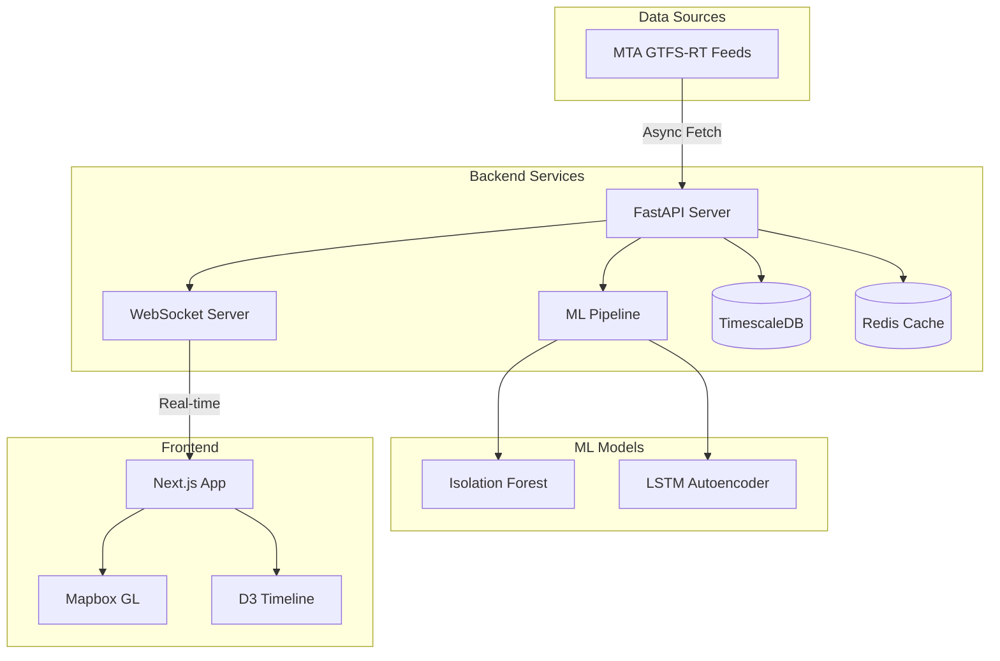

# NYC Subway Monitor - Local Setup (No Docker)

A real-time NYC subway monitoring system that runs locally on Windows, macOS, and Linux without Docker dependencies.

## 🚀 Quick Start

### Prerequisites
- **Windows**: Git Bash or WSL
- **macOS**: Terminal with Homebrew
- **Linux**: Terminal with package manager (apt/yum)

### One-Command Setup

```bash
# Clone and setup (first time)
git clone https://github.com/stelioszach03/nyc-subway-monitor.git
cd nyc-subway-monitor
git checkout local-setup-no-docker
chmod +x setup.sh
./setup.sh --minimal

# Start the application
./start.sh
```

That's it! The application will be running at:
- **Frontend**: http://localhost:3000
- **Backend API**: http://localhost:8000
- **API Documentation**: http://localhost:8000/api/v1/docs

## 📋 What's Included

### ✅ Features
- **Real-time MTA data ingestion** (8 subway feeds)
- **Live train positions** for all NYC subway lines
- **Station information** (1,497 stations)
- **RESTful API** with comprehensive endpoints
- **Health monitoring** and feed status
- **Anomaly detection** (basic version without ML)
- **Cross-platform compatibility** (Windows/macOS/Linux)

### 🗂️ Architecture
- **Backend**: FastAPI with SQLite database
- **Frontend**: Next.js React application
- **Database**: SQLite (no PostgreSQL required)
- **Cache**: In-memory (no Redis required)
- **Data Source**: Live MTA GTFS-RT feeds

### Key Features

- **Real-time Data Ingestion**: Async polling of public MTA GTFS-RT feeds (no API key required)
- **ML-Powered Detection**: Isolation Forest + LSTM autoencoder ensemble
- **Interactive Dashboard**: Mapbox-powered visualization with WebSocket streaming
- **Production-Ready**: Docker, CI/CD, monitoring, and horizontal scaling support

## 🏗️ Architecture



## 🚀 Quick Start

### Prerequisites

- Docker & Docker Compose
- Node.js 20+ (for local development)
- Python 3.12+ (for local development)
- Mapbox API token (free tier works)

### 1. Clone and Setup
```bash
git clone https://github.com/stelioszach03/nyc-subway-monitor.git
cd nyc-subway-monitor

# Copy environment variables
cp .env.example .env

# Add your Mapbox token to .env
echo "MAPBOX_TOKEN=your_mapbox_token_here" >> .env
```

### 2. Start Services
```bash
# Start all services
docker-compose up --build

# Or run individually
docker-compose up -d timescaledb redis  # Start databases
cd backend && uvicorn app.main:app --reload  # Start backend
cd frontend && npm run dev  # Start frontend
```

### 3. Access Dashboard

- **Dashboard**: http://localhost:3000
- **API Docs**: http://localhost:8000/api/v1/docs
- **Grafana**: http://localhost:3001 (admin/admin)
- **Prometheus**: http://localhost:9090

## 📊 ML Models

### Isolation Forest
- Fast unsupervised anomaly detection
- Handles multimodal distributions
- 5% contamination rate
- Features: headway, dwell time, delays

### LSTM Autoencoder
- Captures temporal patterns
- Sequence length: 24 time steps
- Architecture: 128 → 64 → 32 → 64 → 128
- Threshold: 95th percentile reconstruction error

## 🔌 API Reference

### REST Endpoints
```bash
# Get anomalies
GET /api/v1/anomalies?line=6&start_date=2024-01-01

# Get train positions
GET /api/v1/feeds/positions/nqrw

# Trigger detection
POST /api/v1/anomalies/detect
```

### WebSocket
```javascript
// Subscribe to anomalies
ws.send({
  type: 'subscribe',
  filters: { line: '6', severity_min: 0.7 }
})
```

## 🧪 Testing
```bash
# Backend tests
cd backend
pytest --cov=app

# Frontend tests
cd frontend
npm test

# E2E tests
npm run test:e2e
```

## 📈 Performance

- **Ingestion rate**: ~1000 updates/second
- **Detection latency**: <100ms p99
- **Dashboard FPS**: 60 (GPU accelerated)
- **Storage**: ~50GB/month with 7-day retention

## 🚢 Deployment

### Kubernetes
```bash
# Apply manifests
kubectl apply -f k8s/manifests/

# Check status
kubectl get pods -n subway-monitor
```

### Environment Variables

| Variable | Description | Default |
|----------|-------------|---------|
| POSTGRES_HOST | TimescaleDB host | localhost |
| REDIS_URL | Redis connection URL | redis://localhost:6379 |
| FEED_UPDATE_INTERVAL | Seconds between fetches | 30 |
| MODEL_RETRAIN_HOUR | Hour to retrain models (UTC) | 3 |

## 🤝 Contributing

1. Fork the repository
2. Create a feature branch (`git checkout -b feat/amazing-feature`)
3. Commit changes using conventional commits
4. Push to branch (`git push origin feat/amazing-feature`)
5. Open a Pull Request

## 📝 License
MIT License - see LICENSE file

## 🙏 Acknowledgments

- MTA for public GTFS-RT feeds
- nyctrains package maintainers
- TimescaleDB for time-series optimization

<div align="center">
Built with ❤️ for NYC's 4.5 million daily riders
</div>